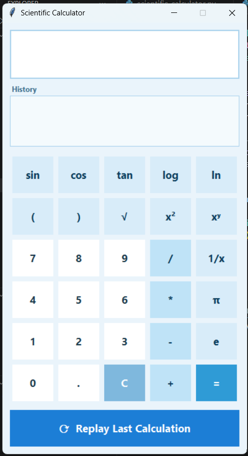

# Scientific-calculator
A modern scientific calculator built using python and Tkinter with scientific functions, history and replay support.
## Features 
- Basic calculation (+,-,*,/)
- Square root
- Power(x^2, x^y)
- Trigonometric functions
- Logarithm
- History
- Clear button
## Technologies Used
- python
- Tkinter
## How to run
''' bash
python calculator.py
'''
## Author
Swastika Biswas
## Screenshot

